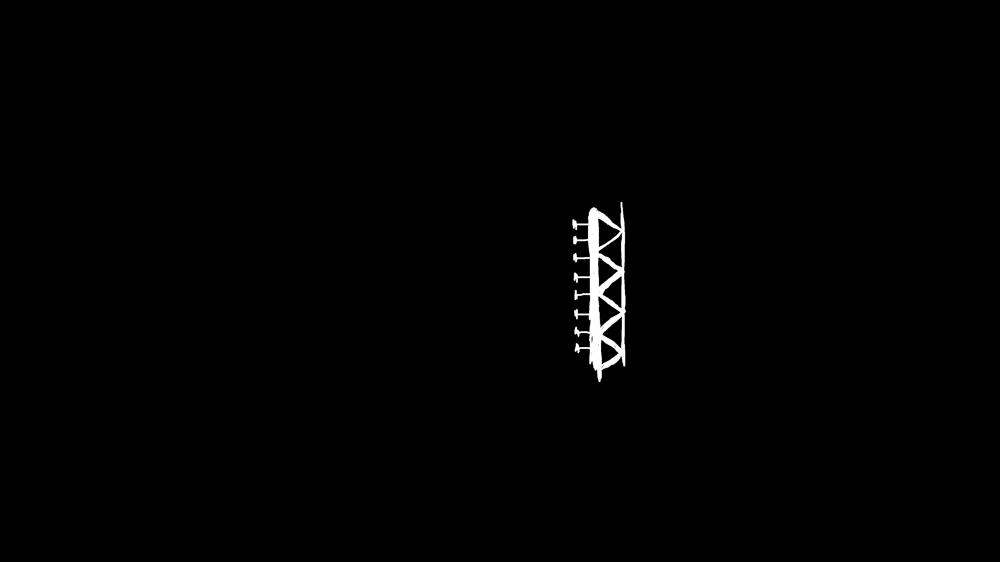
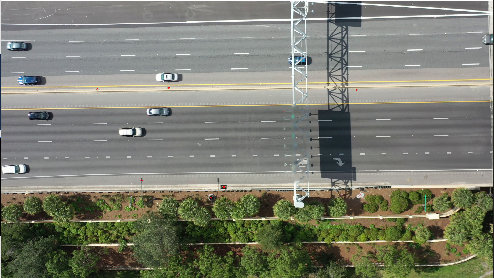
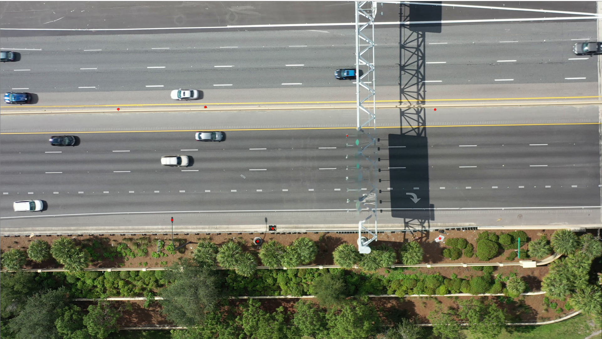

# 图像修复（inpainting）

            在处理卡口或者无人机视频的时候，难免有一些遮挡，镜头污点等等。会对轨迹提取，物体识别的准确度产生一些影响。在这种情况下，我们可以考虑会用到一种传统的图像处理技术叫图像修复（inpainting）。其原理也很简单：用所选区域的周围的像素替换坏掉的像素，这样看上去就和周围一样了。

在OpenCV-python中我们可以调取cv2.inpaint\(\)这个函数来访问，其中包含两种图像修复的方式：

dst = cv2.inpaint\(待修复图片,待修复区域蒙版，权重,修复方式\)


方式1-cv2.INPAINT\_TELEA：是基于Alexandru Telea的论文"**An Image Inpainting Technique Based on the Fast Marching Method"。**是基于像素点快速匹配方法的。首先你需要在图片中选择一个等待修复的区域。该算法会从这个被选中的区域的边界开始，逐渐地向内部进入被选中区域，把边界内的所有原有像素点都替换掉。具体的来说，该算法会提取要修复的部分边界的每一个像素点周围的一圈的像素点。这个像素点会被被周围已知的像素的标准加权和（weighted average over）替换掉。当前像素点被更新过后，该算法会通过快速匹配方法\(FMM\)移动到最近的未修复的像素点重复以前步骤。

方式2-：cv2.INPAINT\_NS：基于2001年的一篇论文论文"**Navier-Stokes, Fluid Dynamics, and Image and Video Inpainting**".这个算法基于流体动力学和偏微分方程。简单的来说，作者认为任何物体的边缘应该是连续的。所以该算法会从已知区域沿着物体边缘到达被选中的待修复区域。然后再待修复区域中建立微偏分方程式（partial differential equation）以约束待修复区域的图像强度（image intensities）然后图像平滑度信息由图像拉普拉斯（image Laplacian）估计和图像的等渗线（isophotes- 图像梯度估计通过旋转90度的得到图像等渗线---------用人看的懂的话来说就是把相同亮度的点用线连起来，类似于轮廓线）。这时候用到流体动力学。之后会填充颜色以减小最小方差。这个算法用标志启用。  
  
照理说，基于Navier-Stokes的修补应该比基于Fast Marching的方法更慢，并且倾向于产生模糊的结果。 但是在实际操作中，我们发现INPAINT\_NS结果更好，并且速度也比INPAINT\_TELEA稍快。

同时在opencv c++版本中还有另外两个方式

1. **Error Concealment \(Inpainting\)**: 
2. **Non-Regular Sampling**:

但是目前在python 代码中还没有同步

### 具体代码如下


```python
import numpy as np
import cv2
#读取待修复图片
img = cv2.imread('messi_2.jpg')
#读取需要修复区域的蒙版（黑底，白色为待修复区域）
mask = cv2.imread('mask2.png',0)
#调取图像修复函数
dst = cv2.inpaint(img,mask,3,cv2.INPAINT_TELEA)
#dst = cv2.inpaint(img,mask,3,cv2.INPAINT_NS)
cv2.imshow('dst',dst)
cv2.waitKey(0)
cv2.destroyAllWindows()

```








### 在视频中调用的方法：

```python
import numpy as np
import cv2

cap = cv2.VideoCapture('./USDJI_0037stab.mov')
mask = cv2.imread('mask.png',0)
while(cap.isOpened()):
	ret, frame = cap.read()
	dst = cv2.inpaint(frame,mask,13,cv2.INPAINT_NS)
	#dst = cv2.resize(dst, (0,0), fx=0.5, fy=0.5) 
	cv2.imshow('frame',dst)
	if cv2.waitKey(1) & 0xFF == ord('q'):
		break
cap.release()
cv2.destroyAllWindows()
```

